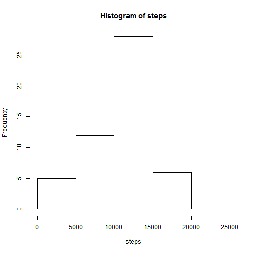
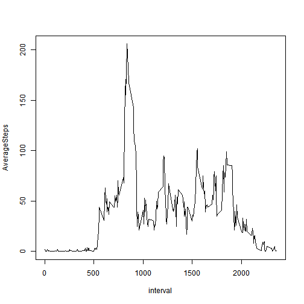
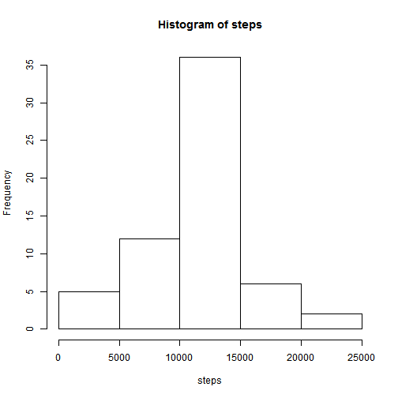
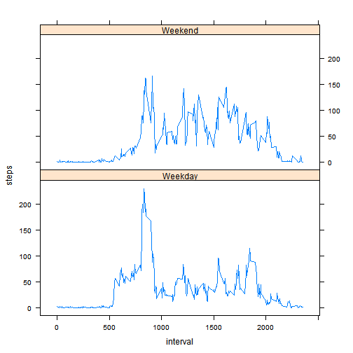

First, a couple of required packages need to be loaded. Note: if dplyr and ggplot2 are not installed on your machine, you will need to install them using `install.packages()`.

```r
library(dplyr)
library(lattice)
```

## Loading and preprocessing the data
The next step is data acquisition. The dataset needs to be downloaded and decompressed to the working directory, and then read from disk into memory using `read.csv()`.

```r
if (!file.exists("activity.zip")) {
    url <- "https://d396qusza40orc.cloudfront.net/repdata%2Fdata%2Factivity.zip"
    download.file(url, "activity.zip")
}

if (!file.exists("activity.csv")) {
    unzip("activity.zip", overwrite = T)
}

activity <- read.csv("activity.csv", stringsAsFactors = F, colClasses = c("integer", "Date", "integer"))
```


## What is mean total number of steps taken per day?
####Calculate the total number of steps taken per day
Using `dplyr`, filter out observations in which the `steps` variable contains a missing value (`NAs`), then group on the `date` variable and aggregate the variable `steps` using `sum()`.

```r
dailyStepsXcludNAs <- activity %>% 
  filter(!is.na(steps)) %>% 
  group_by(date) %>% 
  summarize(steps = sum(steps))
```

####Make a histogram of the total number of steps taken each day
Using the resulting data frame from the previous step, and `hist()`, create a histogram of the total number of steps taken each day.

```r
with (dailyStepsXcludNAs, hist(steps))
```

 

####Calculate and report the mean and median of the total number of steps taken per day

```r
meanDailyStepsXcludNAs <- round(mean(dailyStepsXcludNAs$steps))
medianDailyStepsXcludNAs <- median(dailyStepsXcludNAs$steps)
```
When excluding observations in which the `steps` variable contains a missing value (`NAs`), the rounded mean daily steps are 1.0766 &times; 10<sup>4</sup>, and the median daily steps are 10765


## What is the average daily activity pattern?
####Calculate the average number of steps taken per 5 minute interval
Using `dplyr`, filter out observations in which the `steps` variable contains a missing value (`NAs`), then group on the `interval` variable and aggregate the `steps` variable using `mean()`.  Finally, use `round()` to round to the nearest whole step.

```r
avgStepsByInterval <- activity %>% 
  filter(!is.na(steps)) %>% 
  group_by(interval) %>% 
  summarize(AverageSteps = round(mean(steps)))
```

####Make a time series plot
Using the resulting data frame from the previous step, and `plot()`, create a time series plot of the 5-minute interval (x-axis) and the average number of steps taken, averaged across all days (y-axis).

```r
with (avgStepsByInterval, plot(interval, AverageSteps, type="l"))
```

 

####Which 5-minute interval contains the maximum number of steps?
Use `which.max()` to determine the `interval` with the maximum number of steps.

```r
maxAvgStepsInterval = avgStepsByInterval[which.max(avgStepsByInterval$AverageSteps), ]$interval
```
The 835 interval has the maximum number of steps.


## Imputing missing values
####Calculate and report the total number of missing values in the dataset
Using `dplyr` and `nrow()`, determine the number of rows with missing values.

```r
countOfNAs <- activity %>% 
  filter(is.na(steps)) %>% 
  nrow
```
The are 2304 rows with missing values.

####Create a new dataset that is equal to the original dataset but with the missing data filled in
Using `dplyr`, perform a left join between the original data frame and the `avgStepsByInterval` data frame, and if the `steps` variable contains a `NA` for a given `interval`, replace the `NA` with the average number of `steps` for that `interval`.

```r
imputedActivity <- left_join(activity, avgStepsByInterval, by = c("interval" = "interval")) %>%
  mutate(steps = ifelse(is.na(steps), AverageSteps, steps)) %>% 
  select(steps, date, interval) %>% 
  arrange(date, interval)
```

Using the resulting data frame from the previous step, recalculate the average number of daily steps

```r
dailySteps <- imputedActivity %>% 
  group_by(date) %>% 
  summarize(steps = sum(steps))
```

####Make a histogram of the total number of steps taken each day
Using the resulting data frame from the previous step, and `hist()`, create a histogram of the total number of steps taken each day.

```r
with (dailySteps, hist(steps))
```

 

The impact of imputing missing data becomes apparent when comparing this histogram to the histogram created in the previous section. This histogram shows a noticable increase in the frequency of steps in the 10K-15K bin.

####For the total number of steps taken per day, report the mean and the median

```r
meanDailySteps <- mean(dailySteps$steps)
medianDailySteps <- median(dailySteps$steps)
```
With the missing values imputed, the rounded mean daily steps are 1.0766 &times; 10<sup>4</sup>, and the median daily steps are 1.0762 &times; 10<sup>4</sup>.  These values are very similar to the same values, when computed using the dataset that excluded missing values.


## Are there differences in activity patterns between weekdays and weekends?
####Create a new factor variable in the dataset with two levels weekday & weekend
Using the `imputedActivity` data frame, create a new data frame in which the `date` variable is replaced with a factor variable called `dayType`, which indicated if a given date is a week day or weekend day.

```r
avgStepsByDayTypeInterval <- imputedActivity %>% 
  mutate(dayType = factor(ifelse(weekdays(date, T) %in% c("Sat", "Sun"), "Weekend", "Weekday"))) %>% 
  group_by(dayType, interval) %>% 
  summarize(steps = mean(steps))
```

####Make a panel plot containing a time series plot
Using the resulting data frame from the previous step, and `xyplot()`, create a time series plot `interval` (x-axis), the average number of `steps` taken (y-axis), and conditioning on the `dayType`

```r
xyplot(
  steps ~ interval | dayType, 
  data = avgStepsByDayTypeInterval, 
  layout = c(1, 2), 
  type = "l"
)
```

 

####Differences in activity patterns
As these plot show, there is a noticable difference in activity patterns between weekdays and weekends.

* There is more activity during the early to mid-moring intervals on weekdays when compared to weekend days
* After the initial activity on weekday mornings, there a marked decline in activity for the remainder of the day, with sporatic spikes in activity
* Weekend activity ramps up slower than during the week, and similar to weekday activity there is a marked decline just before 10a; however, unlike weekdays, after this initial decline there is a more substancial increase in activity through out the remainder of the day, i.e. more steps for longer durations of time

